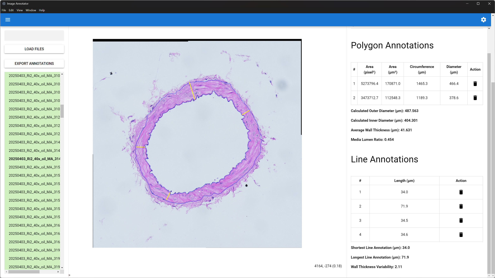
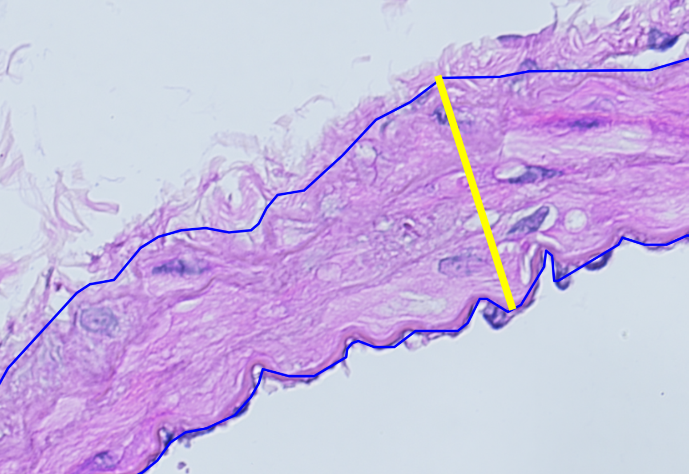

# Image Annotator

Desktop application for morphometric annotation of histological vessel cross-sections.

The tool was developed to quantify arterial wall geometry on TIFF microscopy images in support of a doctoral monograph. It lets an observer outline the outer and inner vessel contours, measure local wall thickness, and export calibrated morphometric parameters.



*Main window. Left: TIFF series with annotation status (green complete, orange incomplete, red missing). Centre: zoomable image canvas. Right: polygon and line measurements plus derived vessel metrics.*



*Annotation detail. Blue polygons follow the inner and outer media borders. The yellow line is a local wall-thickness measurement.*

## What it measures

Two annotation types are available:

- **Polygons** for closed contours, typically the outer media border and the lumen (inner) border.
- **Lines** for local wall-thickness chords between those borders.

From the two polygons the application derives an idealized circular vessel by preserving the outer circumference and the measured wall area. Reported quantities include:

| Quantity | Meaning |
| --- | --- |
| Area, circumference, diameter | Per polygon, in pixels and in micrometres |
| Outer / inner diameter | Diameters of the idealized circular vessel |
| Average wall thickness | Radial difference between those circles |
| Media–lumen ratio | Wall area divided by calculated lumen area |
| Wall-thickness variability | Longest divided by shortest line annotation |

A spatial calibration in micrometres per pixel can be set per image (default `0.36`). The last used value is reused for newly opened files.

## Typical workflow

1. Enter the folder that contains the TIFF images and choose **Load Files**.
2. Select an image. Existing annotations load automatically from `annotations/<filename>_annotations.json`.
3. Draw the outer and inner polygons (left click to add vertices; hold the right mouse button to trace densely; **Enter** to close; **Escape** to cancel).
4. Draw at least two wall-thickness lines (two clicks each).
5. Adjust **Micrometer Per Pixel** if the acquisition calibration differs from the default.
6. **Export Annotations** writes a semicolon-separated CSV (decimal comma) for spreadsheet software.

The file list is colour-coded: **complete** means at least two polygons and two lines, **incomplete** means some annotations exist, **missing** means none.

Keyboard and canvas controls:

- Mouse wheel zooms; drag pans; double-click resets the view.
- **Enter** finishes the current polygon and saves JSON sidecars.
- **Escape** discards the annotation in progress.

## Output files

Each annotated image gets a JSON sidecar:

```text
<folder>/annotations/<filename>_annotations.json
```

The file stores the calibration and a list of annotations (`type`: `polygon` or `line`) with vertex coordinates in image pixels.

The CSV export contains one row per annotated image:

`filename`, `sample_id`, `type` (`AA` or `MA` parsed from the file name), `microPerPixel`, `mediaLumenRatio`, `averageWallThicknessInMicro`, `outerCalculatedDiameterInMicro`, `innerCalculatedDiameterInMicro`, `wallThicknessVariability`, `shortestLineAnnotationLengthInMicro`, `longestLineAnnotationLengthInMicro`.

`sample_id` is the four-digit token in the file name; `type` is `AA` when the name contains `AA`, otherwise `MA`.

## Requirements

- Node.js 20 or later
- [pnpm](https://pnpm.io/)
- Windows, macOS, or Linux (the published workflow was used on Windows)

## Development

```bash
pnpm install
pnpm dev
```

This starts the Electron app with hot reload.

```bash
pnpm lint
pnpm format
pnpm build
```

`pnpm build` packages a desktop application with electron-builder.

## Architecture

The user interface is a [Quasar](https://quasar.dev/) / Vue 3 renderer. [Konva](https://konvajs.org/) draws the image and overlays. The Electron main process reads TIFF files with [sharp](https://sharp.pixelplumbing.com/), converts them to PNG for the canvas, and reads or writes annotation JSON on disk.

This repository is intended as a citable companion to the monograph. Analysis pipelines that consume the CSV/JSON output may include it as a Git submodule.

## Licence

MIT. See [LICENSE](LICENSE).
